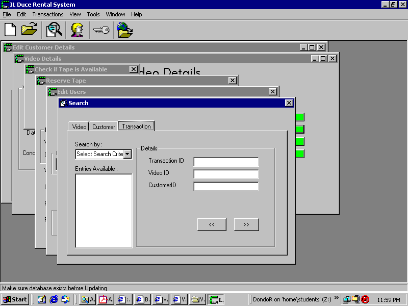



## Video Rental System using ADO

### Description

This is a program that uses the ADODB connections to link to an Access database. All connections are created/opened at runtime. Security,passwords,usernames are in Database. Users are in two user groups. Uses SQL statements such as INsert, SElect etc. Links to website uses MDI form and Child Forms. Toolbar with Image list. Status bar that displays a random message. Data Reports using Datareport control. Class Module Example. ISnumeric validation. Search facility for searching the database. examples of using the List View Control
 
### More Info
 
reports

             |
---                |---
**Submitted On**   |2004-11-22 22:37:20
**By**             |[John DoeJan2010](https://github.com/Planet-Source-Code/PSCIndex/blob/master/ByAuthor/john-doejan2010.md)
**Level**          |Intermediate
**User Rating**    |4.2 (25 globes from 6 users)
**Compatibility**  |VB 6\.0
**Category**       |[Databases/ Data Access/ DAO/ ADO](https://github.com/Planet-Source-Code/PSCIndex/blob/master/ByCategory/databases-data-access-dao-ado__1-6.md)
**World**          |[Visual Basic](https://github.com/Planet-Source-Code/PSCIndex/blob/master/ByWorld/visual-basic.md)
**Archive File**   |[Video\_Rent18212011232004\.zip](https://github.com/Planet-Source-Code/john-doejan2010-video-rental-system-using-ado__1-57388/archive/master.zip)

